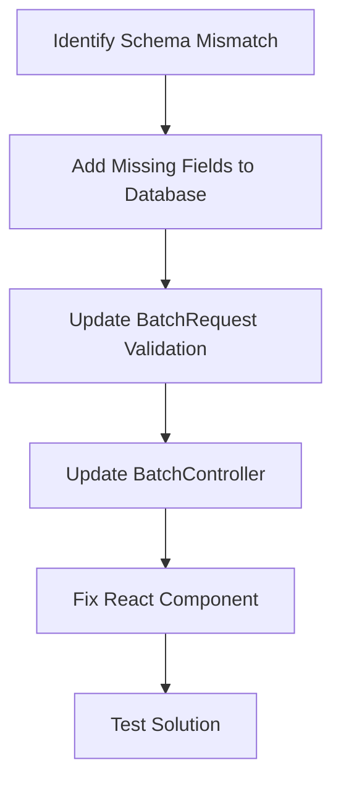

# Batch Edit Page Fix Plan

## Problem Analysis

Based on my investigation, I've identified a critical mismatch between the database schema and the React component:

1. **Database Schema vs. Component Props Mismatch**: 
   - The batches table in the database has columns: `id`, `farm_id`, `batch_number`, `start_date`, `end_date`, and `weight_kg` (added in a later migration).
   - However, the React edit component is expecting additional fields: `wool_type`, `status`, `arrival_date`, and `notes`.

2. **Component Error**: 
   - When the edit page loads, the React component tries to access properties that don't exist in the batch object returned from the server.
   - This likely causes a JavaScript error that prevents the page from rendering anything.

3. **Controller Implementation**:
   - The BatchController's edit method is passing the batch object directly to the view without ensuring all required fields exist.
   - The update method validation doesn't match the fields used in the form.

## Proposed Solution

Here's my plan to fix the issue:



### 1. Add Missing Fields to Database

Create a new migration to add the missing fields to the batches table:
- `wool_type` (string)
- `status` (string)
- `arrival_date` (date)
- `notes` (text)

```php
// New migration file
Schema::table('batches', function (Blueprint $table) {
    $table->string('wool_type')->nullable()->after('weight_kg');
    $table->string('status')->nullable()->after('wool_type');
    $table->date('arrival_date')->nullable()->after('status');
    $table->text('notes')->nullable()->after('arrival_date');
});
```

### 2. Update BatchRequest Validation

Update the BatchRequest validation rules to include the new fields.

```php
// Updated BatchRequest.php
public function rules(): array
{
    return [
        'farm_id'       => 'required|exists:farms,id',
        'batch_number'  => 'required|string|max:255',
        'start_date'    => 'required|date',
        'end_date'      => 'nullable|date',
        'wool_type'     => 'nullable|string|max:255',
        'weight_kg'     => 'nullable|numeric',
        'status'        => 'nullable|string|max:255',
        'arrival_date'  => 'nullable|date',
        'notes'         => 'nullable|string',
    ];
}
```

### 3. Update BatchController

Modify the BatchController's update method to handle the new fields.

```php
// Updated BatchController.php update method
public function update(BatchRequest $request, Batch $batch)
{
    $validated = $request->validated();
    
    $batch->update($validated);

    return redirect()->route('batches.index')->with('success', 'Batch updated successfully.');
}
```

### 4. Fix React Component

Ensure the React component properly handles potentially undefined values for these fields.

```tsx
// Updated edit.tsx component
const { data, setData, put, processing, errors } = useForm({
  farm_id: batch.farm_id.toString(),
  batch_number: batch.batch_number,
  start_date: batch.start_date,
  end_date: batch.end_date || "",
  wool_type: batch.wool_type || "",
  weight_kg: batch.weight_kg?.toString() || "",
  status: batch.status || "",
  arrival_date: batch.arrival_date || "",
  notes: batch.notes || "",
});
```

### 5. Test Solution

Test the edit page to ensure it works correctly after the changes:
1. Run the migration to add the missing fields
2. Access the batch edit page
3. Verify that the form loads correctly
4. Test updating a batch with the new fields
5. Verify that the changes are saved to the database

## Implementation Steps

1. Create a new migration file:
   ```bash
   php artisan make:migration add_missing_fields_to_batches_table
   ```

2. Update the BatchRequest.php file with the new validation rules

3. Update the BatchController.php file to use the BatchRequest for validation

4. Modify the React component to handle potentially undefined values

5. Run the migration:
   ```bash
   php artisan migrate
   ```

6. Test the solution