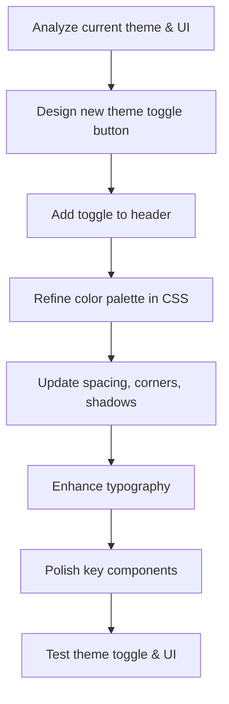

# UI Prettification & Theme Toggle Button Plan

## 1. Current State Analysis

- **Theme Handling:**  
  - Theming is managed via a custom hook (`use-appearance`) and Tailwind CSS `dark:` classes.
  - Theme preference is stored in `localStorage` and a cookie for SSR.
  - Existing components for appearance toggling:  
    - `appearance-dropdown.tsx` (dropdown for theme selection)
    - `appearance-tabs.tsx` (tabs for theme selection)
  - Theme is initialized in `app.tsx` with `initializeTheme()`.

- **UI Styling:**  
  - Uses Tailwind CSS utility classes for styling.
  - Many components already have dark mode styles.
  - Some pages use custom color palettes and rounded corners.

---

## 2. Plan for UI Improvements

### A. Theme Toggle Button

- **Goal:** Add a prominent, always-accessible theme toggle button.
- **Placement:** Top-right in the main header (`app-header.tsx`).
- **Implementation:**
  - Simple icon toggle (sun/moon) that switches between light and dark only.
  - Updates the theme globally and persists preference.

### B. UI “Prettification”

- **Color Palette:**  
  - Refine color choices for backgrounds, borders, and text for better contrast and vibrancy.
  - Use modern accent colors for buttons and highlights.

- **Spacing & Layout:**  
  - Increase padding/margin for breathing room.
  - Use more rounded corners and subtle shadows for cards and panels.

- **Typography:**  
  - Use larger font sizes for headings.
  - Improve font weights and spacing for readability.

- **Components:**  
  - Update buttons, cards, and sidebar with more visually appealing styles.
  - Add hover/active effects for interactivity.

---

## 3. Implementation Steps

---

## 4. Details

- **Theme Toggle Button:**  
  - Place in `app-header.tsx` (top-right) for global access.
  - Use icon (sun/moon) that reflects current theme.
  - On click, toggle between light and dark modes only.

- **UI Enhancements:**  
  - Update `resources/css/app.css` for color and spacing tweaks.
  - Refactor key components (`button.tsx`, `card.tsx`, `sidebar.tsx`) for improved visuals.
  - Ensure all pages/components look good in both light and dark modes.

- **Persistence:**  
  - Theme preference remains stored in `localStorage` and cookie.

---

## 5. Next Steps

- Switch to implementation mode to execute the plan.